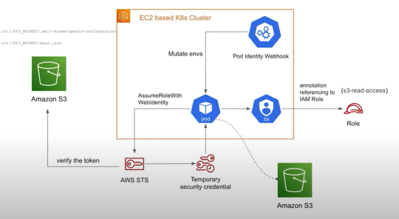

# 1. Set Up an OIDC Provider in AWS Using S3
- AWS IAM OpenID Connect (OIDC) requires a publicly accessible OIDC discovery endpoint. Since you don’t have an AWS-managed cluster like EKS, you’ll need to host it manually using an S3 bucket.

### Steps to Configure OIDC Provider
1. Create an S3 Bucket

```sh
aws s3api create-bucket --bucket <your-bucket-name> --region us-east-1
```
- Ensure the bucket is publicly accessible or use CloudFront with signed URLs.

2. Generate an OIDC Discovery Document `(/.well-known/openid-configuration)`

- Create a JSON file (openid-configuration.json) with the following content:
```json
{
  "issuer": "https://<your-bucket-name>.s3.amazonaws.com",
  "jwks_uri": "https://<your-bucket-name>.s3.amazonaws.com/keys.json",
  "response_types_supported": ["id_token"],
  "subject_types_supported": ["public"],
  "id_token_signing_alg_values_supported": ["RS256"]
}
```

3. Generate JSON Web Keys `(keys.json)`

- Use Kubernetes API server's service account keys:
```sh
openssl genrsa -out private.pem 2048
openssl rsa -in private.pem -pubout -out public.pem
```
- Convert to JWKS format:
```json
{
  "keys": [
    {
      "kty": "RSA",
      "alg": "RS256",
      "use": "sig",
      "kid": "1",
      "n": "<base64-encoded-public-key>",
      "e": "AQAB"
    }
  ]
}
```
- Save this as keys.json and upload it to S3.

4. Upload OIDC Files to S3
```sh
aws s3 cp openid-configuration.json s3://<your-bucket-name>/.well-known/openid-configuration
aws s3 cp keys.json s3://<your-bucket-name>/keys.json
```

5. Create an AWS OIDC Identity Provider
```sh
aws iam create-open-id-connect-provider \
  --url "https://<your-bucket-name>.s3.amazonaws.com" \
  --client-id-list "sts.amazonaws.com" \
  --thumbprint-list "<thumbprint>"
```
- You can get the S3 bucket's thumbprint using:
```sh
openssl s_client -showcerts -connect <your-bucket-name>.s3.amazonaws.com:443 </dev/null 2>/dev/null | openssl x509 -fingerprint -noout
```

# 2. Configure Kubernetes Service Account for Pod Identity

1. Create a Kubernetes Service Account
```yaml
apiVersion: v1
kind: ServiceAccount
metadata:
  name: s3-access-sa
  annotations:
    eks.amazonaws.com/role-arn: "arn:aws:iam::<your-account-id>:role/S3AccessRole"
```

### Apply it:
```sh
kubectl apply -f service-account.yaml
```
2. Create an IAM Role with Trust Policy
```json
{
  "Version": "2012-10-17",
  "Statement": [
    {
      "Effect": "Allow",
      "Principal": {
        "Federated": "arn:aws:iam::<your-account-id>:oidc-provider/<your-bucket-name>.s3.amazonaws.com"
      },
      "Action": "sts:AssumeRoleWithWebIdentity",
      "Condition": {
        "StringEquals": {
          "<your-bucket-name>.s3.amazonaws.com:sub": "system:serviceaccount:default:s3-access-sa"
        }
      }
    }
  ]
}
```

3. Attach an IAM Policy to the Role
```json
{
  "Version": "2012-10-17",
  "Statement": [
    {
      "Effect": "Allow",
      "Action": ["s3:ListBucket", "s3:GetObject"],
      "Resource": ["arn:aws:s3:::<your-s3-bucket>/*"]
    }
  ]
}
```

# 3. Deploy a Test Pod
### Create a test pod using the service account:
```yaml
apiVersion: v1
kind: Pod
metadata:
  name: test-s3-pod
spec:
  serviceAccountName: s3-access-sa
  containers:
  - name: aws-cli
    image: amazonlinux
    command: [ "sleep", "3600" ]
```
### Apply it:
```sh
kubectl apply -f test-pod.yaml
```
# 4. Test the Setup
1. Exec into the Pod
```sh
kubectl exec -it test-s3-pod -- bash
```
2. Verify AWS Identity
```sh
yum install -y aws-cli
aws sts get-caller-identity
```
3. Access S3
```sh
aws s3 ls s3://<your-s3-bucket>
```