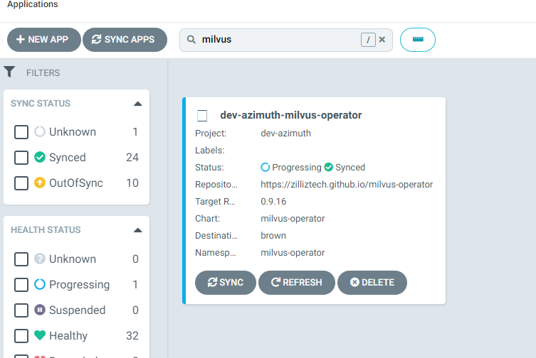

### Step 1. Create rbac rule milvus in namespace milvus from brown-dev-001 namespace
- Open azimuth-profile repo
- open `states\dev\rbac\cluster-roles.yaml`
- Add
```yml
# milvus roleBinding
apiVersion: rbac.authorization.k8s.io/v1
kind: RoleBinding
metadata:
  name: milvus-role-binding
  namespace: milvus
roleRef:
  apiGroup: rbac.authorization.k8s.io
  kind: Role
  name: milvus-role
subjects:
  - kind: ServiceAccount
    name: default-editor
    namespace: brown-dev-001
```
- Open `states\dev\dev-001.yaml`
- Add
```yml
# milvus roleBinding
apiVersion: rbac.authorization.k8s.io/v1
kind: RoleBinding
metadata:
  name: milvus-role-binding
  namespace: milvus
roleRef:
  apiGroup: rbac.authorization.k8s.io
  kind: Role
  name: milvus-role
subjects:
  - kind: ServiceAccount
    name: default-editor
    namespace: brown-dev-001
```
### Step 2: Create milvus-operator
- Open `azimuth-deployment` repo
- Open `milvus\nonlive\terragrunt.hcl`
```t
terraform {
  source = "git::ssh://git@github.com/AZU-IGNITE/azimuth-terraform-modules.git//argocd-application-deployment?ref=v1.0.5"
}

locals {
  aws_region = "eu-west-1"

  clusters = {
    dev-azimuth = {
      url = "https://kube-api.paas-brown.astrazeneca.net:6443"
      env = "dev"
      branch = "devel"
    }
  }
}

generate "provider" {
  path      = "provider.tf"
  if_exists = "overwrite_terragrunt"
  contents  = <<EOF
provider "aws" {
  region = "${local.aws_region}"
}

provider "argocd" {
  server_addr = var.argocd_host
  username    = var.argocd_username
  password    = var.argocd_password
  insecure    = true
}
EOF
}

include {
  path = find_in_parent_folders()
}

inputs = {

  app_name = {
    milvus-operator = {
      priority        = "0"
      repo_url        = "https://zilliztech.github.io/milvus-operator"
      target_revision = "0.9.16"
      path            = "milvus-operator"
      namespace       = "milvus-operator"
      helm_args       = "--create-namespace --namespace milvus-operator --include-crds"
      plugin_name     = "argocd-vault-plugin-helm"
      helm_values     = {
        image = {
          repository   = "docker.io/milvusdb/milvus-operator"
        }
        podAnnotations = {
          "sidecar.istio.io/inject" = "false"
        }
        podLabels = {
          "sidecar.istio.io/inject" = "false"
        }
      }
      clusters        = local.clusters
      enable_replace = true
    }
  }
}
```
- Create MR
- Check for successfully run action
- Check successfully creation of application in argocd


### Step 3: Create milvus clulster 
- Create Secret which contain aws cred
```yaml
apiVersion: v1
data:
  accesskey: QUtJQXXXXXXXXXXXXXXXXXXEg=
  secretkey: dndXXXXXXXXXXXXXXXXVuUw==
kind: Secret
metadata:
  name: milvus-secret
  namespace: milvus
type: Opaque
```
- deploy milvus in milvus namespace
```yaml
apiVersion: milvus.io/v1beta1
kind: Milvus
metadata:
  name: milvus-main
  namespace: milvus
  labels:
    app: milvus
spec:
  mode: cluster
  dependencies:
    storage:
      external: true
      type: S3
      endpoint: s3.eu-west-1.amazonaws.com:443
      secretRef: "milvus-secret"
    etcd:
      inCluster:
        deletionPolicy: Delete
        pvcDeletion: true
        values:
          replicaCount: 1
          image:
            registry: docker.io
            repository: milvusdb/etcd
            tag: 3.5.5-r4
    pulsar:
      inCluster:
        deletionPolicy: Delete
        pvcDeletion: true
        values:
          extraEnvVars:
          - name: http_proxy
            value: "http://raghib.in:9480"
          - name: https_proxy
            value: "http://raghib.in:9480"
          - name: no_proxy
            value: "10.0.0.0/8,172.29.0.0/8,localhost,127.0.0.1,::1,.kubeflow"
          images:
            zookeeper:
              repository: docker.io/apachepulsar/pulsar
              pullPolicy: IfNotPresent
            bookie:
              repository: docker.io/apachepulsar/pulsar
              pullPolicy: IfNotPresent
            autorecovery:
              repository: docker.io/apachepulsar/pulsar
              pullPolicy: IfNotPresent
            broker:
              repository: docker.io/apachepulsar/pulsar
              pullPolicy: IfNotPresent
            proxy:
              repository: docker.io/apachepulsar/pulsar
              pullPolicy: IfNotPresent
            pulsar_manager:
              repository: docker.io/apachepulsar/pulsar-manager
              pullPolicy: IfNotPresent
              hasCommand: false
          monitoring:
            prometheus: false
            grafana: false
            node_exporter: false
            alert_manager: false
          components:
            autorecovery: true
            bookkeeper: true
            broker: true
            pulsar_manager: true
            zookeeper: true
            functions: false
            proxy: true
            toolset: false
          pulsar_metadata:
            component: pulsar-init
            image:
              repository: docker.io/apachepulsar/pulsar
          zookeeper:
            replicaCount: 3
          bookkeeper:
            replicaCount: 3
          broker:
            replicaCount: 1
          proxy:
            replicaCount: 1
          pulsar_manager:
            replicaCount: 1
          autorecovery:
            replicaCount: 1
  components:
    image: docker.io/milvusdb/milvus:v2.4.0
  config:
    minio:
      bucketName: raghib-milvus-bucket
      useSSL: true
```

### Step 4 : Create milvus
- Create secret
- Create milvus in brown-dev-001 ns

```yaml
apiVersion: milvus.io/v1beta1
kind: Milvus
metadata:
  name: milvus-dev-001
  namespace: brown-dev-001
  labels:
    app: milvus
spec:
  mode: cluster
  dependencies:
    storage:
      external: true
      type: S3
      endpoint: s3.eu-west-1.amazonaws.com:443
      secretRef: "milvus-secret"
    etcd:
      external: true
      endpoints: ["milvus-demo-etcd.milvus.svc.cluster.local:2379"]
    pulsar:
      external: true
      endpoint: "milvus-demo-pulsar-proxy.milvus.svc.cluster.local:6650"
  components:
    image: docker.io/milvusdb/milvus:v2.4.0
    podAnnotations:
      sidecar.istio.io/inject: "false"
  config:
    etcd:
      rootPath: brown-dev-001
    msgChannel:
      chanNamePrefix:
        cluster: brown-dev-001
    minio:
      bucketName: raghib-milvus-bucket
      rootPath: milvus/brown-dev-001
      useSSL: true
```