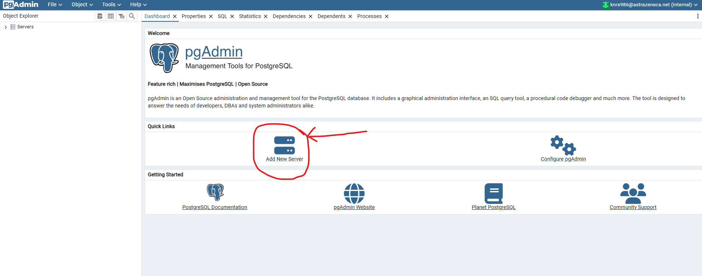
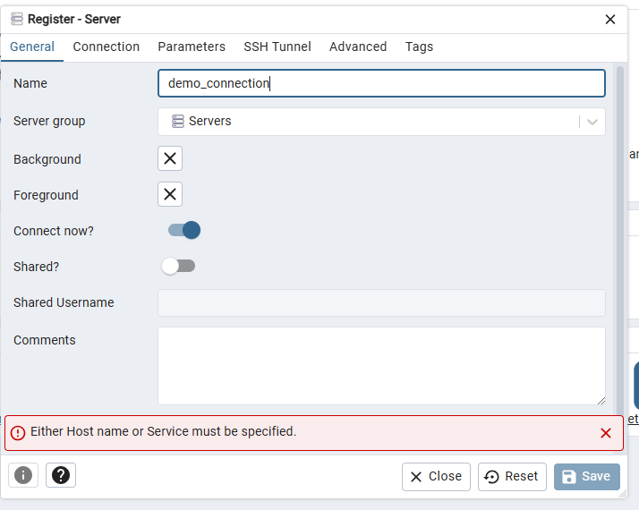
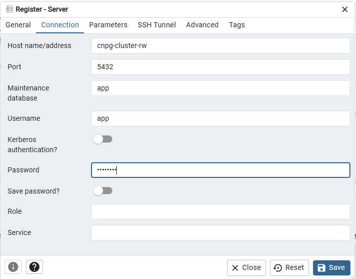
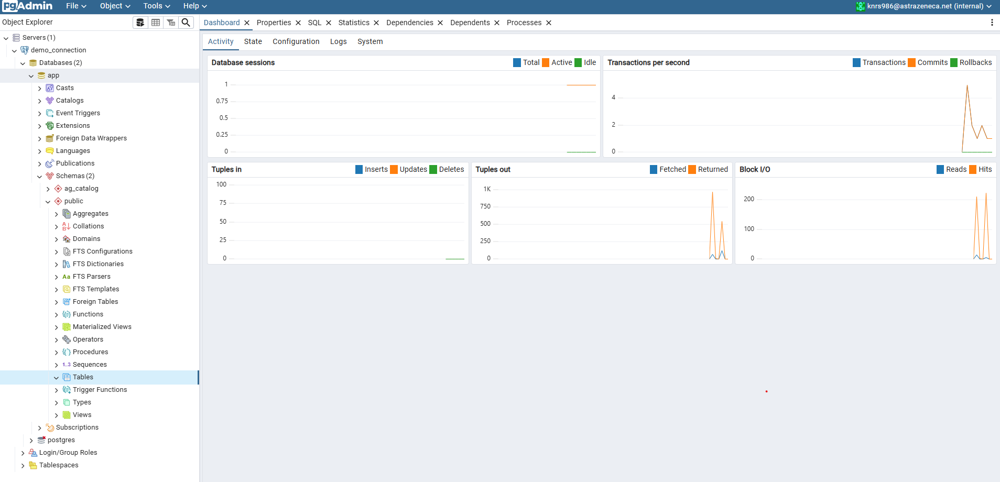

1. Create pg admin deloyment, service and ingress
```yaml
apiVersion: v1
data:
  password: dGVzdDEyMw==
kind: Secret
metadata:  
  name: pgadmin-password
  namespace: brown-dev-001
type: Opaque
---
apiVersion: apps/v1
kind: Deployment
metadata:
  name: pgadmin
spec:
  selector:
    matchLabels:
      app: pgadmin
  replicas: 1
  template:
    metadata:
      annotations:
        sidecar.istio.io/inject: "false"
      labels:
        app: pgadmin
    spec:
      containers:
        - name: pgadmin
          image: harbor.csis.astrazeneca.net/dpage/pgadmin4:8.14.0
          ports:
            - containerPort: 80
              name: pgadminport
          env:
            - name: PGADMIN_DEFAULT_EMAIL
              value: "knrs986@astrazeneca.net"
            - name: PGADMIN_DEFAULT_PASSWORD
              valueFrom:
                secretKeyRef:
                  name: pgadmin-password
                  key: password
            - name: PGADMIN_PORT
              value: "80"
            - name: http_proxy
              value: http://azpse.astrazeneca.net:9480
            - name: https_proxy
              value: http://azpse.astrazeneca.net:9480
            - name: no_proxy
              value: 10.0.0.0/8,172.29.0.0/8,astrazeneca.net
          resources:
            limits:
              cpu: "1"
              memory: "1Gi"
            requests:
              cpu: "0.5"
              memory: "500Mi"
---
apiVersion: v1
kind: Service
metadata:
  name: pgadmin
  labels:
    app: pgadmin
spec:
  selector:
   app: pgadmin
  type: ClusterIP
  ports:
   - port: 80
---
apiVersion: networking.k8s.io/v1
kind: Ingress
metadata:
  annotations:
    kubernetes.io/ingress.class: nginx
    nginx.ingress.kubernetes.io/configuration-snippet: |
      add_header X-Frame-Options "ALLOW-FROM *.paas-brown.astrazeneca.net";
      proxy_hide_header X-Frame-Options;
    nginx.ingress.kubernetes.io/proxy-body-size: 2000M
    nginx.ingress.kubernetes.io/proxy-read-timeout: "180"
    nginx.ingress.kubernetes.io/proxy-send-timeout: "180"
  name: pgadmin-ingress
  namespace: brown-dev-001
spec:
  rules:
  - host: pgadmin-demo-azimuth.paas-brown.astrazeneca.net
    http:
      paths:
      - backend:
          service:
            name: pgadmin
            port:
              number: 80
        path: /
        pathType: Prefix
```
2. Deploy this to brown-dev-001 namespace
```sh
kubectl -n brown-dev-001 apply -f .\pgadmin.yaml
```
3. Get the URL from ingress amnifest file script
```sh
kubectl -n brown-dev-001 get ingress pgadmin-ingress -o jsonpath='{.spec.rules[0].host}'
```
4. Get the username from pgadmin deployment manifest file
```sh
kubectl -n brown-dev-001 get deploy pgadmin -o jsonpath='{.spec.template.spec.containers[0].env[0].value}'
```
5. Get the credential from secret
```sh
kubectl -n brown-dev-001 get secret pgadmin-password -o jsonpath='{.data.password}' | base64 -d
```
6. Open the pgadmin in web browser and login to pgadmin4
7. Click on Add New Server

8. Register your cnpg cluster, Add your connection name in General tab

9. Click on COnnection TAB
10. Fill the detail of cnpg cluster details
```t
host: <service name of cnpg with rw access>
maintenance database: app
username: app
password: <get from cnpg from secret>
```
- Get password
```sh
kubectl -n brown-dev-001 get secret app-secret -o jsonpath='{.data.password}' | base64 -d
```

11. Get tables
