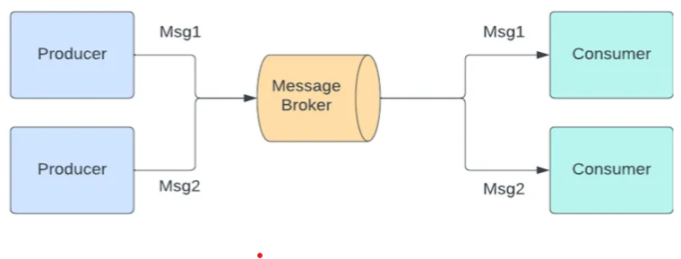
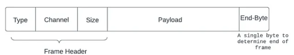
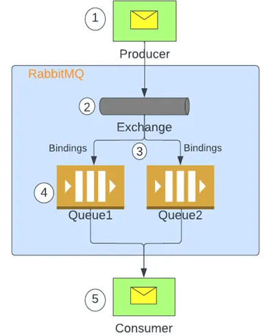

# RabbitMQ

## Why we need Message Brokers
As the microservices architecture consists of numerous independent services, the connections between these services become messively large.

We can’t rely on request/response-based systems in this situation since applications usually wait for another service’s response. A client triggering an inherently time-consuming service, such as one that requires significant computing resources,  this cause problamatic situation. This can impact the user experience if the client is a front-end application as the UI becomes unresponsive

All these factors create a need for asynchronous communication between the microservices, and Message Based Systems can help. In such a system, a new component called an intermediary is introduced to facilitate communication between two applications/services instead of directly establishing communication between them. This middle component is known as Message Broker


## What is Message Broker?
Message Brokers aid in decoupling applications as they are not directly interacting with each other. Each application only needs to adhere to the data format of this Message Broker, and it does not need to handle the nuances of interacting with different services. Therefore, it simplifies incorporating diverse applications in the system.

## What is RabbitMQ?
RabbitMQ is an extremely popular open-source Message Broker used for building message-based systems. Although RabbitMQ supports multiple protocols, the most commonly used is AMQP.

#### **Key Concepts**
● ***Producer***: Application that sends the messages.

● ***Consumer***: Application that receives the messages.

● ***Queue***: Stores messages that are consumed by applications

● ***Connection***: A TCP connection between your application and the RabbitMQ broker.

● ***Channel***: Lightweight connections that share a single TCP connection. Publishing or or consuming messages from a queue is done over a channel.

● ***Exchange***: Receives messages from producers and pushes them to queues depending on rules defined by the exchange type. A queue must be bound to at least one exchange to receive messages.

● ***Binding***: Bindings are rules that exchanges use (among other things) to route messages to queues.

● ***Routing key***: A key that the exchange uses to decide how to route the message to queues. Think of the routing key as an address for the message.

● ***Users***: It is possible to connect to RabbitMQ with a given username and password. Users can be assigned permissions such as rights to read, write, and configure privileges within the instance. Users can also be assigned permissions for specific virtual hosts.

● ***Vhost, virtual host***: Virtual hosts provide logical grouping and separation of resources. Users can have different permissions to different vhost(s), and queues and exchanges can be created so they only exist in one vhost

#### **What is AMQP?**
AMQP (Advanced Message Queuing Protocol) is a messaging protocol that enables conforming client applications to communicate with conforming messaging middleware brokers. It’s an application layer protocol that transmits data in binary format. In this application, data is sent as frames.


#### ***How Message Flow in RabbitMQ?***

1. Producer publishes messages to exchange via a channel established between them at the time of application startup.
2. Exchange receives the message and finds appropriate bindings based on message attributes and exchange types.
3. Selected binding is then used to route messages to intended queues.
4. The message stays in the queue until handled by the consumer.
5. Consumers receive the messages using channels established usually at application startup.

#### ***Exchange Types***
Exchanges are entities that receive messages. Exchanges take a message and route it into zero or more queues. The routing algorithm used depends on the exchange type and rules called bindings.
#### There are four types of exchanges.
● ***Direct (Default)***: The message is routed to the queues whose binding key matches the message’s routing key. It is primarily used for unicast routing of messages.

● ***Fanout***: It routes messages to all the queues bound to it, and the routing key is ignored.

● ***Topic***: The topic exchange does a wildcard match between the routing key and the routing pattern specified in the binding.

● ***Header***: The header exchanges use the message header attributes for routing.

#### Queue Types
#### To define a queue in generic terms, it is a sequential data structure with two primary operations: an item can be enqueued (added) at the tail and dequeued (consumed) from the head.
#### Queues play a major role in the messaging technology space. Many messaging protocols and tools assume that publishers and consumers communicate using a queue-like storage mechanism.

## RabbitMQ oficial Sample hello-World example:
1. Sample code to install RabbitMQ is follow: [Install-RabbitMQ](https://github.com/azu-ignite/azimuth-deployment/blob/main/rabbitmq/nonlive/terragrunt.hcl)

2. Get Sample Tutorial from RabbitMQ official github repo, Link [RabbitMQ-Tutorial](https://github.com/rabbitmq/rabbitmq-tutorials/tree/main/python)

3. Cluster will be like as mention below:
```sh
hostname: dev-azimuth-rabbitmq-cluster-nonlive-0.dev-azimuth-rabbitmq-cluster-nonlive-headless.rabbitmq-system.svc.cluster.local' 
# <rabbitmq-cluster-name><service-name>.<namespace>.svc.cluster.local'
username: rabbit
password: <Get from secret - dev-azimuth-rabbitmq-cluster-nonlive>
```

4. First Sample is for send and recieve message to RabbitMQ. Follow [README.md](https://github.com/rabbitmq/rabbitmq-tutorials/blob/main/python/README.md) file

5. Following sample tutorial for [Two-Queue](https://www.rabbitmq.com/tutorials/tutorial-two-python.html), [Publish/susbcribe](https://www.rabbitmq.com/tutorials/tutorial-three-python.html), [Routing](https://www.rabbitmq.com/tutorials/tutorial-four-python.html), [Topics](https://www.rabbitmq.com/tutorials/tutorial-five-python.html) and [RPC](https://www.rabbitmq.com/tutorials/tutorial-six-python.html).
